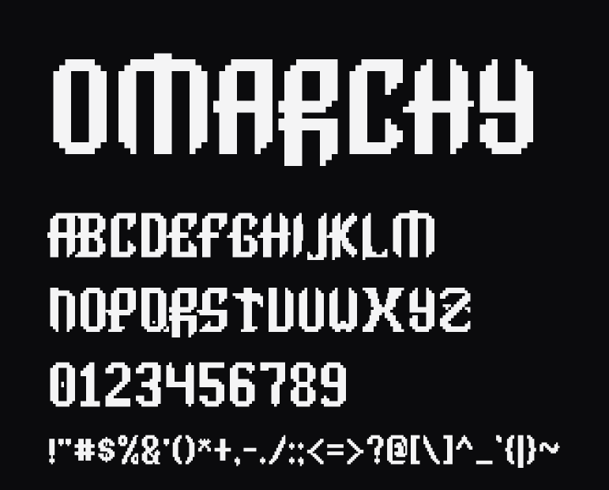

# Omarchy Font

The [Omarchy](https://omarchy.org) wordmark as a real, installable font. Type anything and get the block-built letters of the logo.



**[Try it in the browser →](https://demo-rust-rho-59.vercel.app)**

## Install

Download [`Omarchy Font.ttf`](Omarchy%20Font.ttf) and install it like any other font.

- **macOS / Windows:** double-click the file, then click *Install*.
- **Linux:** copy it to `~/.local/share/fonts/` and run `fc-cache -f`.

On the web:

```css
@font-face {
  font-family: "Omarchy Font";
  src: url("Omarchy Font.ttf") format("truetype");
}
```

## What you get

- The seven letters of the wordmark (O M A R C H Y) match the official `logo.svg` pixel for pixel. Typing `OMARCHY` reproduces the logo exactly, spacing included.
- The other nineteen letters are condensed from *Delta Corps Priest 1*, the FIGlet font the wordmark grew out of, using the same rules the wordmark applies: three-cell strokes, three-cell counters, half-block corners.
- Digits and all ASCII punctuation, drawn to match. The FIGlet original has none.
- Unicase: lowercase renders as capitals. 96 code points, 70 glyphs, 7 KB.
- Cells are 1:2 like a terminal, and every glyph is a single merged outline, so there are no seams between rows at any size.

## Build it yourself

The whole face lives in [`source/glyphs.txt`](source/glyphs.txt) as plain block art. Edit it, then rebuild:

```sh
python3 -m pip install fonttools
python3 source/build.py
```

## Credits

Omarchy is by DHH and 37signals. *Delta Corps Priest 1* is by CoSMiC cHiLD. This is a fan project by Mark Cuda, not affiliated with either. Free to use, share and modify.
